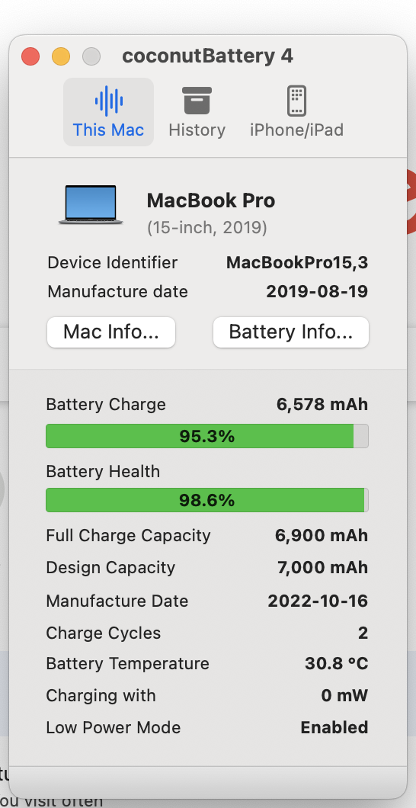
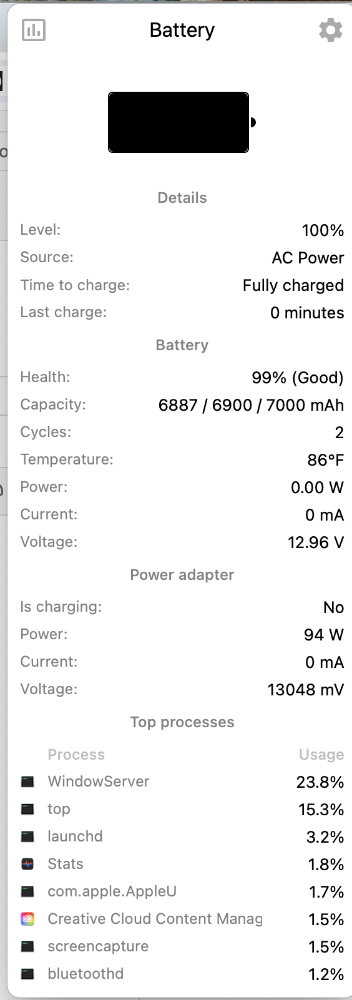
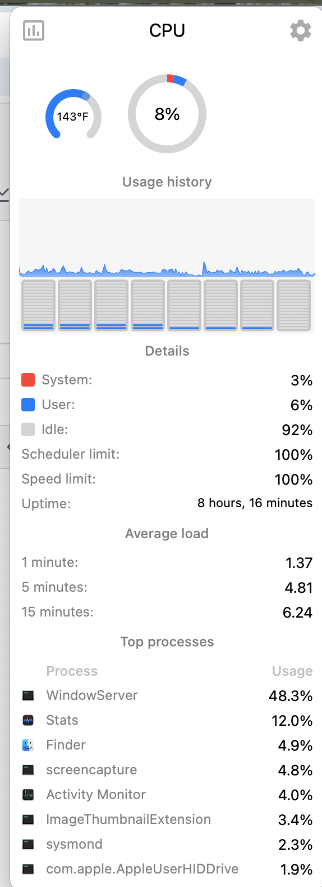
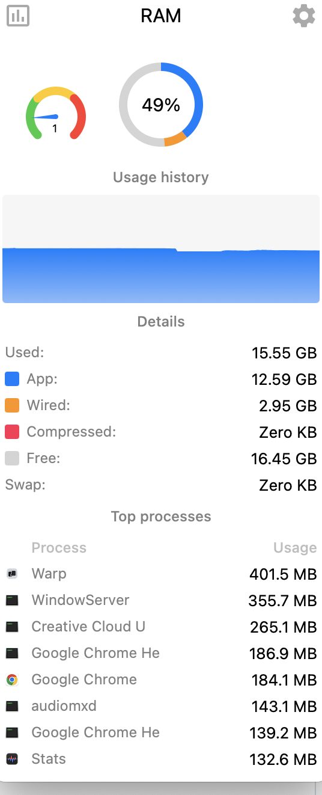
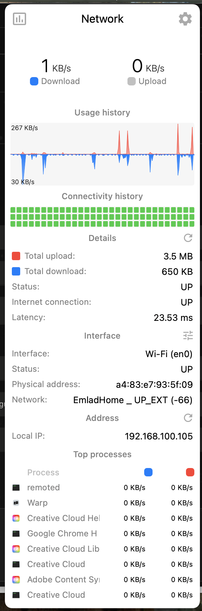

# macOS Battery Monitoring Guide

A comprehensive guide for monitoring battery health and performance on MacBook Pro (2019 15" with Core i9).

## Table of Contents
- [Overview](#overview)
- [Command-Line Tools](#command-line-tools)
- [Graphical Applications](#graphical-applications)
- [Battery Specifications](#battery-specifications)
- [Interpreting Results](#interpreting-results)

## Overview

This guide provides tools and commands to monitor MacBook battery health, including capacity, cycle count, temperature, voltage, and charging status.

**Compatible with**: MacBook Pro 15" (2019) - Model A1990, MacBookPro15,3

## Command-Line Tools

### 1. System Profiler - Comprehensive Battery Info
Get detailed battery information including manufacturer, capacity, cycle count, and condition.

```bash
system_profiler SPPowerDataType
```

**Key Information Provided:**
- Battery serial number and manufacturer
- Full charge capacity (mAh)
- Cycle count
- Battery condition (Normal/Replace Soon/Replace Now)
- Charging status
- AC adapter information

**Example Output:**
```
Power:

    Battery Information:

      Model Information:
          Serial Number: C0XXXXXXXXXX90ME3
          Manufacturer: ifixit
          Device Name: bq40z451
          Pack Lot Code: 3230
          PCB Lot Code: 3230
          Firmware Version: 2d31
          Hardware Revision: 322d
          Cell Revision: 3036
      Charge Information:
          The battery's charge is below the warning level: No
          Fully Charged: Yes
          Charging: No
          Full Charge Capacity (mAh): 6900
          State of Charge (%): 100
      Health Information:
          Cycle Count: 2
          Condition: Normal
```

### 2. Power Management Settings
Check current battery status and power source.

```bash
pmset -g batt
```

**Output includes:**
- Current power source (AC/Battery)
- Battery percentage
- Charging status
- Time remaining estimate

### 3. Battery Capacity Details
Get raw battery capacity data including design vs. current capacity.

```bash
ioreg -rn AppleSmartBattery | grep -i capacity
```

**Key Metrics:**
- `DesignCapacity`: Original battery capacity (mAh)
- `MaxCapacity`: Current maximum capacity (mAh)
- `CurrentCapacity`: Current charge level (mAh)

**Battery Health Calculation:**
```
Battery Health % = (MaxCapacity / DesignCapacity) × 100
```

### 4. Voltage, Temperature, and Amperage
Monitor battery electrical characteristics.

```bash
ioreg -l -w0 | grep -E "\"Temperature\"|\"Voltage\"|\"Amperage\"" | grep -v "Temperature(C)" | head -10
```

**Key Values:**
- **Temperature**: In hundredths of degrees Celsius (e.g., 3075 = 30.75°C)
- **Voltage**: In millivolts (e.g., 12845 = 12.845V)
- **Amperage**: Current draw in milliamps (0 = fully charged, negative = discharging)

### 5. Thermal Management Status
Check if thermal throttling is affecting battery performance.

```bash
pmset -g thermlog
```

**Monitors:**
- Thermal warning levels
- CPU performance limits
- System temperature status

### 6. Power Management Configuration
View all power management settings.

```bash
pmset -g
```

**Shows:**
- Low power mode status
- Sleep timers
- Power nap settings
- Display and disk sleep settings

### 7. Hardware Overview
Verify MacBook model and specifications.

```bash
system_profiler SPHardwareDataType
```

**Confirms:**
- Model identifier
- Processor type
- Memory
- Serial number

## Graphical Applications

### Installed Tools

#### 1. **CoconutBattery** (Free)
Comprehensive battery monitoring with historical tracking.

**Installation:**
```bash
brew install --cask coconutbattery
```

**Launch:**
```bash
open -a coconutBattery
```

**Features:**
- Design capacity vs. current capacity comparison
- Battery age and manufacture date
- Detailed cycle count
- Temperature monitoring
- Historical data tracking
- iOS device battery monitoring (when connected)

**Location:** `/Applications/coconutBattery.app`

**Screenshot:**



*CoconutBattery displaying battery health (98.6%), cycle count (2), and temperature (30.8°C) for a newly installed iFixit battery.*

---

#### 2. **Stats** (Free, Open Source)
Real-time system monitoring in the menu bar.

**Installation:**
```bash
brew install --cask stats
```

**Launch:**
```bash
open -a Stats
```

**Features:**
- Menu bar battery widget
- Real-time power consumption
- CPU, memory, disk, and network monitoring
- Customizable display options
- Lightweight and efficient

**Location:** `/Applications/Stats.app`
**GitHub:** https://github.com/exelban/stats

**Screenshots:**



*Battery monitoring showing 100% charge, 99% health (6887/6900/7000 mAh), 2 cycles, 86°F temperature, and power consumption details.*



*CPU monitoring displaying 8% usage, 143°F temperature, usage history, and top processes. Shows 8 hours 16 minutes uptime with detailed load averages.*



*Memory monitoring showing 49% RAM usage (15.55 GB used / 32 GB total). Breakdown: 12.59 GB App memory, 2.95 GB Wired, 16.45 GB Free.*



*Network monitoring displaying real-time bandwidth usage, connectivity history, and network interface details including local IP address.*

---

#### 3. **Battery Health** (Pre-installed)
Simple battery health monitoring.

**Location:** `/Applications/Battery Health.app`

---

### Recommended Additional Tools

#### **iStat Menus** (Paid - ~$12)
Professional-grade system monitoring suite.

**Installation:**
```bash
brew install --cask istat-menus
```

**Features:**
- Advanced battery statistics
- Historical graphs
- Detailed power consumption breakdown
- Comprehensive system monitoring
- Highly customizable

**Website:** https://bjango.com/mac/istatmenus/

---

#### **AlDente** (Free/Paid)
Battery charging limiter to extend battery lifespan.

**Installation:**
```bash
brew install --cask aldente
```

**Features:**
- Charge limiting (e.g., stop at 80%)
- Sailing mode (discharge while plugged in)
- Heat protection
- Battery calibration tools
- Extends battery longevity for plugged-in usage

**Website:** https://apphousekitchen.com/

## Battery Specifications

### MacBook Pro 15" (2019) - Model A1990, MacBookPro15,3

**Original Apple Battery:**
- Model: A1953
- Capacity: 7,336 mAh (nominal) / 7,000 mAh (firmware)
- Energy: 83.6 Wh
- Voltage: 11.4V
- Rated Cycles: 1,000 cycles

**iFixit Replacement Battery:**
- Part Number: A1953 replacement
- Design Capacity: 7,000 mAh
- Energy: 83.6 Wh
- Voltage: 11.4V
- Manufacturer: iFixit
- Device Name: bq40z451

**Purchase Link:**
- iFixit Store: https://www.ifixit.com/products/macbook-pro-15-retina-mid-2018-2019-battery
- Amazon: Search "iFixit A1953 MacBook Pro 15 battery"

## Interpreting Results

### Battery Health Status

| Health % | Status | Action |
|----------|--------|--------|
| 100-80% | Excellent | Normal use |
| 80-70% | Good | Monitor regularly |
| 70-60% | Fair | Consider replacement soon |
| < 60% | Poor | Replacement recommended |

### Cycle Count Guidelines

- **0-300 cycles**: Like new
- **300-500 cycles**: Good condition
- **500-800 cycles**: Normal wear
- **800-1000 cycles**: Approaching end of life
- **1000+ cycles**: Consider replacement

### Temperature Ranges

- **20-30°C (68-86°F)**: Optimal
- **30-35°C (86-95°F)**: Normal under load
- **35-40°C (95-104°F)**: Warm, monitor if persistent
- **40°C+ (104°F+)**: Hot, reduce load or enable low power mode

### Voltage Ranges (11.4V nominal battery)

- **12.6-13.0V**: Fully charged
- **11.4-12.6V**: Normal operating range
- **10.8-11.4V**: Low battery
- **< 10.8V**: Critical, charge immediately

## Tips for Battery Longevity

1. **Avoid extreme temperatures** - Keep between 10-35°C (50-95°F)
2. **Don't keep at 100%** - If always plugged in, use AlDente to limit charge to 80%
3. **Calibrate occasionally** - Fully discharge and recharge every 1-2 months
4. **Use low power mode** - When doing light tasks to reduce heat and power draw
5. **Update macOS** - Battery management improves with updates
6. **Avoid deep discharges** - Don't regularly drain below 20%

## Low Power Mode

Enable low power mode to reduce battery heat and extend runtime:

```bash
# Low power mode is enabled via System Settings
# Check status:
pmset -g | grep lowpowermode
```

**Low Power Mode Effects:**
- Reduced CPU/GPU performance
- Lower display brightness
- Minimal background activity
- Disabled automatic downloads
- Reduced visual effects

## Troubleshooting

### Battery Running Hot

1. Check thermal status: `pmset -g thermlog`
2. Enable low power mode
3. Ensure good ventilation
4. Check for runaway processes: `top -o cpu`
5. Update macOS and apps
6. Reset SMC if issues persist

### Inaccurate Battery Percentage

1. Calibrate battery (full discharge → full charge)
2. Reset SMC (shutdown → Shift+Control+Option+Power for 10s)
3. Reset NVRAM/PRAM (reboot → hold Command+Option+P+R for 20s)

### Battery Not Charging

1. Check AC adapter connection
2. Inspect USB-C ports for debris
3. Try different USB-C port
4. Test with different charger if available
5. Check `system_profiler SPPowerDataType` for charger info

## Contributing

Found a useful command or tool? Feel free to contribute to this guide!

## License

This guide is provided as-is for educational purposes.

---

**Created:** January 1, 2026  
**MacBook Model:** MacBook Pro 15" (2019), MacBookPro15,3, Core i9  
**Battery:** iFixit A1953 replacement (83.6 Wh)

Co-Authored-By: Warp <agent@warp.dev>
